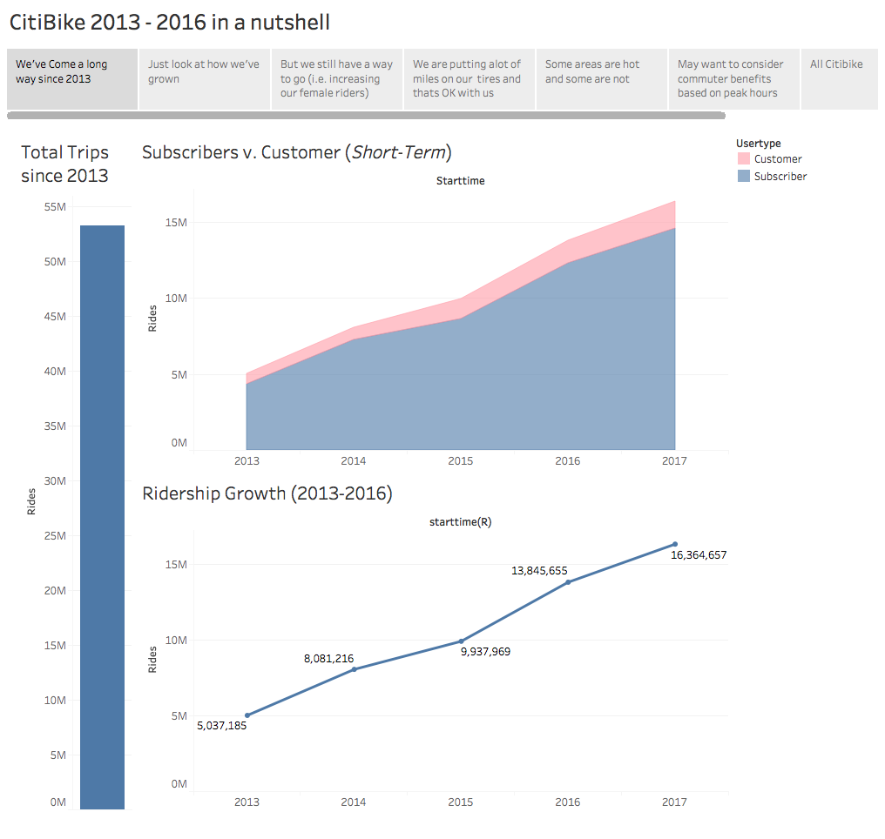
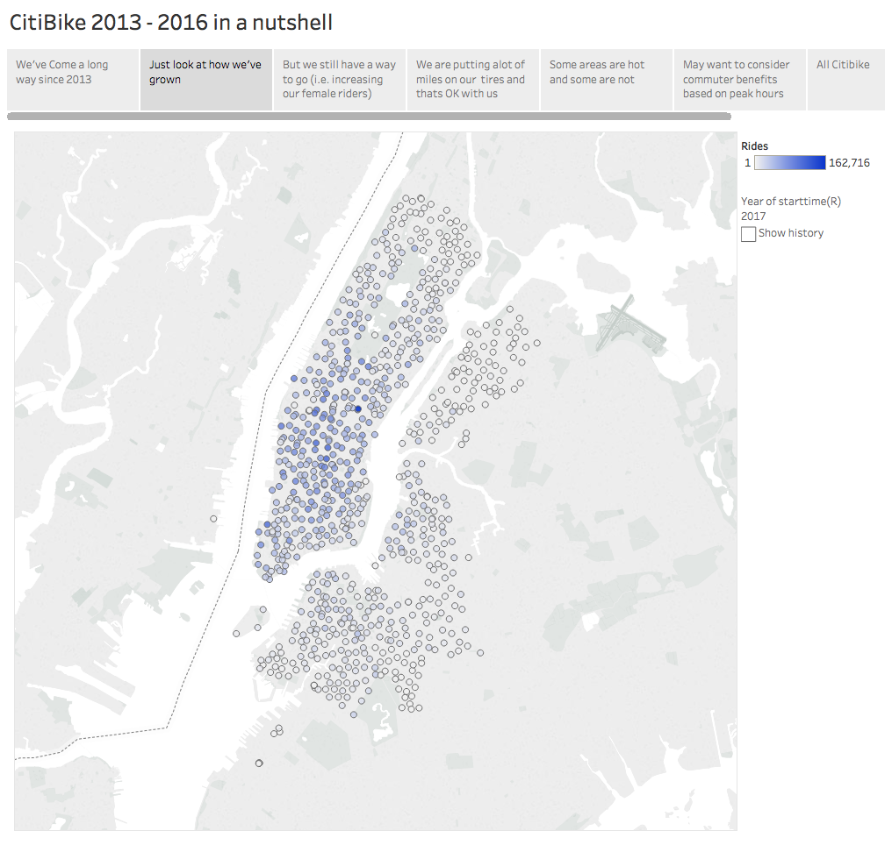
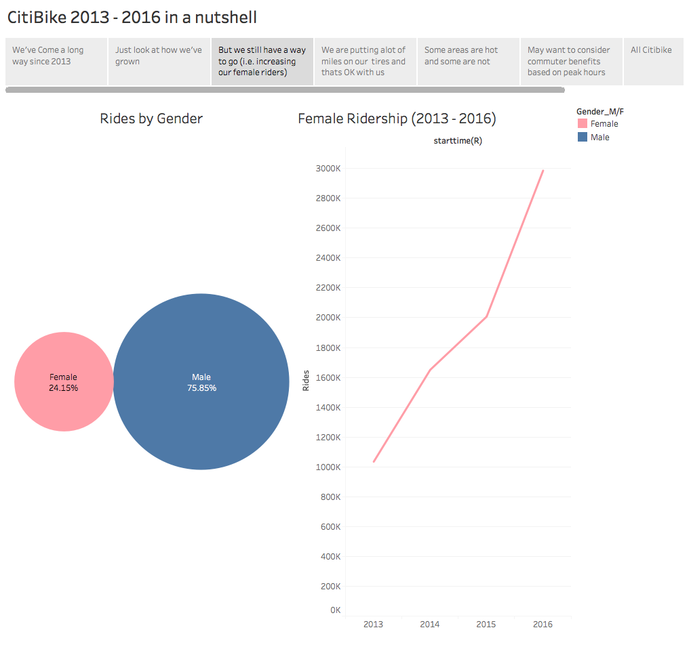
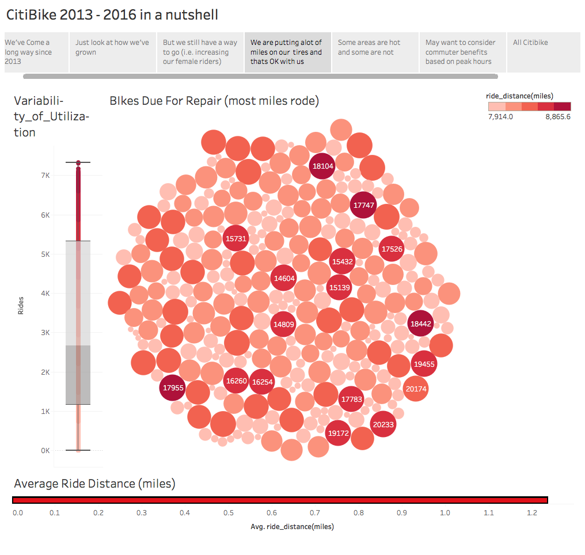
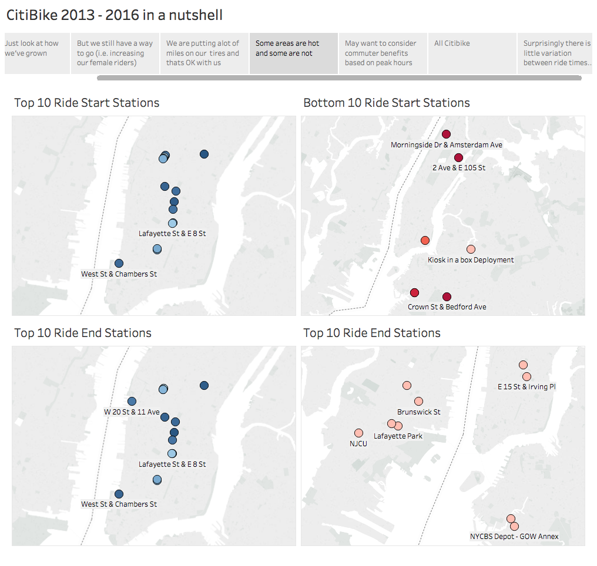
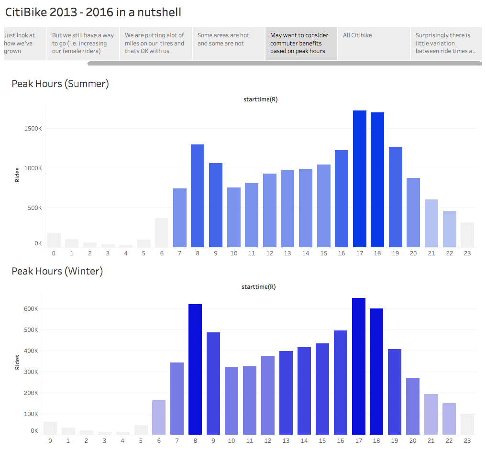
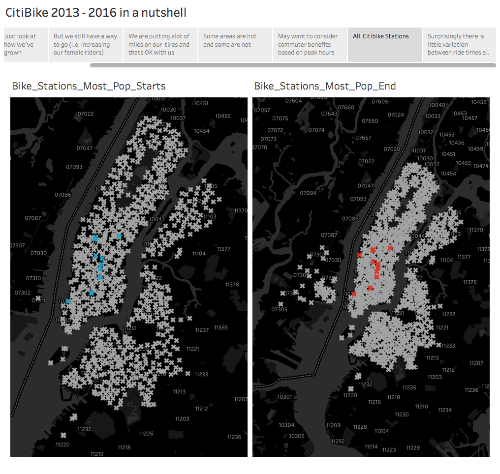
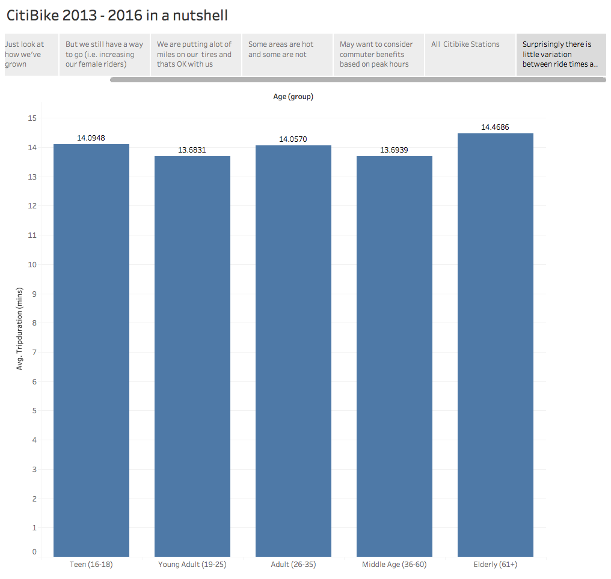

## City Bike Visualized (with Tableau)

I compiled 2013-2017 Citibike ride data from [https://www.citibikenyc.com/system-data](https://www.citibikenyc.com/system-data)

After cleaning the data, using pandas to standardize the date formats, I combined all of the files into one csv file. 

This one file was inported into tableau and I created the story below:

